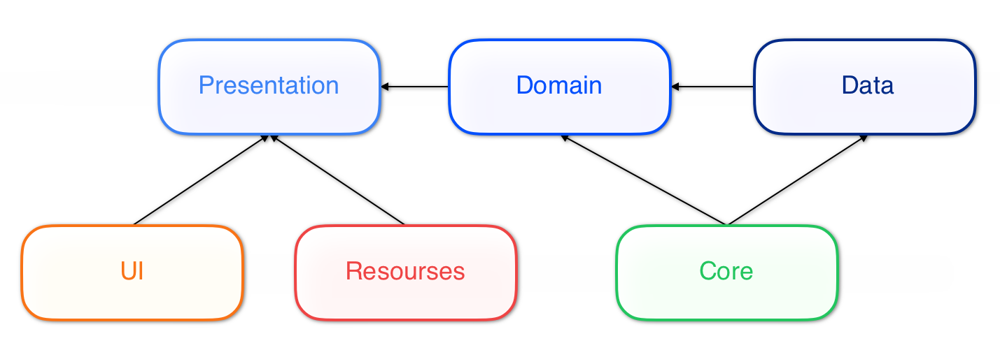

# DemoApp — Modular iOS Architecture with Swift Package Manager DSL

Demo project for the article about a type-safe modular architecture for iOS built on top of Swift Package Manager.

The repository shows how `Package.swift` can be used as a small architecture DSL instead of a flat list of string-based targets and dependencies.

## What is in the repo

- `DemoApp/Package.swift`
  - defines shared modules
  - defines feature layers
  - generates feature targets with helper functions
- `DemoApp/DemoApp.xcodeproj`
  - iOS application target
  - consumes selected products from the local Swift package
- `DemoApp/Sources`
  - shared modules: `Core`, `UI`, `DI`, `Resources`, `Networking`
  - feature modules under `Sources/Features`

## Architecture shape

The package currently demonstrates two target-generation patterns.



*High-level dependency structure generated by `Package.swift`.*

### 1. Classic feature layering

For regular features we generate:

- `Feature_Presentation`
- `Feature_Domain`
- `Feature_Data`

This is used for:

- `MainScreen`
- `DetailScreen`


### 2. API / Implementation split

For infrastructure-style modules we generate:

- `Feature_Api`
- `Feature_Impl`

This is used for:

- `Router`

Dependency flow:

```text
Impl -> Api
Impl -> Core
```

## Current demo modules

Shared modules:

- `Core` mock module
- `UI` 
- `DI` mock module
- `Resources` 
- `Networking`

Generated feature modules:

- `Router_Api`
- `Router_Impl`
- `MainScreen_Presentation`
- `MainScreen_Domain`
- `MainScreen_Data`
- `DetailScreen_Presentation`
- `DetailScreen_Domain`
- `DetailScreen_Data`

## Project highlights

- Module names are expressed as Swift values, not loose strings.
- Feature targets are generated from reusable rules.
- Shared resources are packaged through SPM resources.
- Networking is isolated behind a dedicated module using `Alamofire`.
- Router composition is split into public API and implementation targets.

## Run the demo

Open the app project:

```bash
open DemoApp/DemoApp.xcodeproj
```

## Important notes

- The package depends on `Alamofire`, so the first dependency resolution requires network access.
- The repository is meant to demonstrate package structure and dependency rules first.
- Some parts of the demo are intentionally lightweight and optimized for explaining the architecture, not for production completeness.

## Folder map

```text
ProjectRoot
├── README.md
└── DemoApp
    ├── DemoApp.xcodeproj
    ├── Package.swift
    ├── DemoApp
    └── Sources
        ├── Core
        ├── DI
        ├── Networking
        ├── Resources
        ├── UI
        └── Features
            ├── Router
            ├── MainScreen
            └── DetailScreen
```

## Purpose

This project is a compact, readable companion to the article. The main goal is to show how architectural rules can live directly in `Package.swift` and stay maintainable as the number of modules grows.
